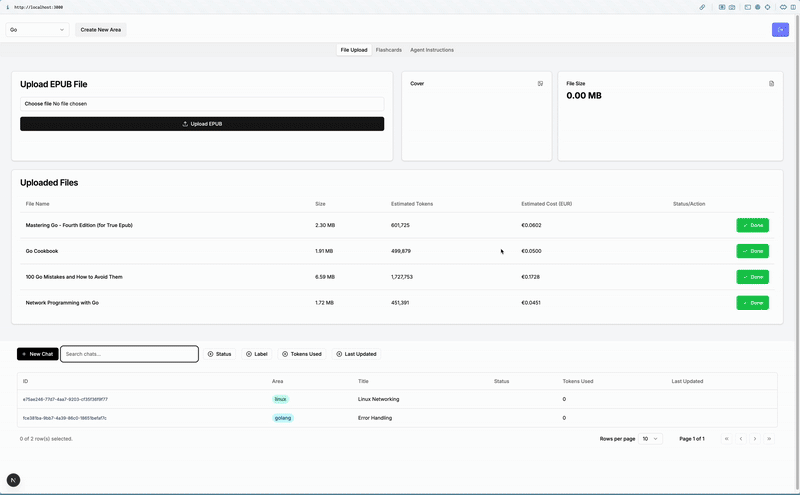

[](https://www.gnu.org/licenses/gpl-3.0.en.html)

This tool was originally created to explore AI-driven learning workflows.  
Read the full story and motivations in my [blog post](https://…).

The project has a modular structure with a Next.js frontend and a Python backend split across multiple packages using
Poetry. LLM logic is decoupled from the API layer to potentially make it easier to swap out frameworks or languages.
This
decoupling is one of the core architectural goals—and challenges. The setup also serves as a sandbox for experimenting
with systems design and working with a modern, service-oriented stack.



## 🏗 Architecture & Tech Stack

- **LangGraph** – Multi-agent state machine orchestrator for LLM workflows
- **Server** – Python 3.10+, FastAPI, Pydantic, structured as multiple Poetry-managed packages
- **Frontend** – Next.js App Router with Server Actions and Server-Sent Events
- **Databases** – PostgreSQL for structured data, Chroma for embeddings, Firebase for blob storage
- **Deployment** – Docker Compose for local orchestration

---

## 💻 Installation

As of now, the app is intended for local development. VPS deployment is on the roadmap.

### Local Setup with Docker

To get everything running, make sure your `.env` files are correctly configured (see `.env.example`), then simply run:

```bash
docker compose -f docker-compose.dev.yml up
```

### Local Development

To run the frontend and backend manually (e.g., with hot reload during development), use the following:

**Backend:**

```bash
cd backend
poetry run fastapi dev server/main.py --port 8080
```

**Frontend:**

```bash
cd frontend
pnpm dev
```

*Make sure the Docker services (Postgres, Chroma, etc.) are still running in the background via Compose.*

---

## 🛡 Server

### Authorization

OAuth2-based authentication follows FastAPI’s official guide.  
Routes and security logic are defined in [`security.py`](backend/server/core/security.py).

### Controllers & Services

- [`ChatController`](backend/server/controller/chat_controller.py): Handles WebSocket connections and invokes
  `ChatService`.
- [`EmbeddingController`](backend/server/controller/embedding_controller.py): Provides REST endpoints to initiate EPUB
  parsing and embedding workflows.
- [`FlashcardsController`](backend/server/controller/flashcards_controller.py): Manages flashcard operations and Anki
  export via `AnkiService`.

### Chat & Streaming

The `statemachine` package also powers real-time chat via WebSockets.

- **`ChatService`**: Wraps LangGraph calls with `get_openai_callback()` to capture usage metadata (token counts,
  timing). Outputs are packaged into `ChatOutputStreamDTO`.
- **WebSocket Endpoint** (`/ws/{chat_id}`): Streams each LLM response chunk together with metadata, allowing the Next.js
  frontend to render text progressively and display live telemetry.

---

## 📚 Epub Parser

The parser is tested with books from the 3 main publishers in the tech publishing space. O'Reilly media,
Manning shelter Island and Packt Publishing (Conditionally also tested with No Starch Press)

A dedicated [`EpubProcessingService`](backend/server/service/embedding/epub_processing_service.py) decouples parsing
from API logic. Located in the [tools Poetry package](backend/tools), the parser traverses the epub file and extracts
the raw html data, then it parses the html to plain text in order to prepare them for the vector embedding.

1. Finds the EPUB’s TOC file
2. Breaks content into sub-chapters
3. Persists chapters in Postgres ([`Chapter`](backend/server/models/document.py) model)
4. Queues each chapter for embedding

**Libraries used**:

- `beautifulsoup4` for HTML traversal
- Python’s built-in `zipfile` to extract EPUB contents

## 🧠 Embedding Pipeline (RAG Preprocessing)

A dedicated EmbeddingService handles the transformation of parsed chapters into vectors. It:

- Retrieves sanitized plain text of each chapter from Postgres

- Generates vector embeddings in Chroma DB, organizing collections by learning area

- Applies metadata weighting experiments (e.g. boosting title tokens for more relevant retrieval)

**Libraries used**:

- `chromadb` client for vector storage

## 🔄 Statemachine Package

A self-contained Poetry package [`statemachine`](backend/statemachine) that implements multi-agent workflows as a state
machine using LangGraph. The main chat functionality and vector DB retrieval are orchestrated by the [
`RagAgent`](backend/statemachine/agents/rag/rag_agent.py), which leverages LangChain Expression Language (LCEL) for
precise control over execution parameters—most notably the selection and weighting of retrieved documents.

### Design Principles

- **Main Agent: `RagAgent`**
    - Streams chat responses and handles vector DB retrieval with metadata-aware prompts.
- **Graph as State Machine**
    - Each agent node represents a state; edges define transitions. The top‑level orchestrator, the [
      `SupervisorAgent`](backend/statemachine/agents/supervisor/supervisor.py), receives the initial output from
      `RagAgent`
      and drives the workflow based on its [
      `SupervisorState`](backend/statemachine/agents/supervisor/supervisor_state.py).
- **Separation of Concerns**
    - Decision logic—such as agent orchestration, gap analysis, and flashcard creation—remains isolated from external
      services (DB access, HTTP routes, SSE), ensuring the core graph is clean, testable, and maintainable.

### Key Modules

- **`StateGraph`**: Builds the directed graph from a configuration of agents and transitions, used by `SupervisorAgent`.
- **`StateExecutor`**: Traverses the graph, invoking each agent’s `run()` method and evaluating transition conditions
  defined in
  `supervisor_state.py`.
- **Agent Interfaces**: Abstract base classes (`BaseAgent`, `StreamableAgent`) defining the contract for custom agents
  like
  `KnowledgeIdentificationAgent` and `FlashcardAgent`.

### Agents

#### Knowledge Identification Agent

Implemented in [
`knowledge_identification_agent.py`](backend/statemachine/agents/analysis/knowledge_identification_agent.py),
this agent inspects a user’s question, identifies knowledge gaps, and outputs a list of missing concepts for follow-up.

#### Flashcard Creating Agent

Defined in [`flashcard_agent.py`](backend/statemachine/agents/rag/flashcard_agent.py), the `FlashcardAgent` transforms
identified gaps into study cards in a two-step process:

1. **Content Generation**: Builds front and back text for each card, using LCEL prompts.
2. **Formatting**: Applies categories and chromatic coding, yielding JSON-ready flashcard objects for downstream
   services.

---

## 🗂 Anki Service

We use the popular `genanki` library to generate and push flashcards into Anki decks. Implemented in [
`anki_service.py`](backend/server/service/anki/anki_service.py), it:

- Converts JSON flashcard objects into `genanki` note and deck models.

---

## 🌐 Frontend

### Local Storage & Caching

- **Zustand Cache**: All data loaded at startup and kept in-memory (no multi-user concerns)
- **Separation**: Frontend cache (Zustand) vs backend storage (FastAPI + SQLModel)
- **UI‑First**: Instant filtering, mutation, and coordination for modern SPA interactivity

### Chat Table

[`ChatTable.tsx`](frontend/workers/epub-processor.worker.ts)

- Reused from shadcn/UI examples—fully accessible & responsive
- Built with `@tanstack/react-table` using `useReactTable` for state management

### Main Components

- [**Chat**](frontend/workers/epub-processor.worker.ts): Session interaction UI with live WebSocket streaming and
  Markdown rendering
- [**Console**](frontend/src/components/containers/console.tsx): “Bento” view exposing document viewer, flashcards, and
  creator tabs for RAG embedding & area control
- [**Dashboard**](frontend/src/components/containers/console.tsx): Central control panel for file uploads, flashcard
  management, and agent instructions

### EPUB Processor Worker

- **Client‑side JS Worker**: Parses EPUB to extract metadata and cover image before upload [
  `epub-processor.worker.ts`](frontend/workers/epub-processor.worker.ts) :

### Logging & Instrumentation

- **Logger**: Centralized logging via custom [`logger.ts`](frontend/src/lib/logger.ts) in UI to capture errors and
  events

---

## 📈 Observability

🚧 *Currently under active development* – basic integrations are in place. The OpenTelemetry collector is streaming
traces and metrics to the respective services.

- **Metrics & Monitoring**: Prometheus
- **Log Aggregation**: Loki
- **Dashboards**: Grafana
- **Tracing**: OpenTelemetry & Tempo  


---
## Whats next?

### 🛺 Road Map

- Deploy to VPS, with Kubernetes and an API Gateway
- Create research agent that finds best articles addressing knowledge gaps
- Use message broker for queue updates instead SSE
- Optimize WebSocket & rendering performance
- Add logging and other metrics
- Pagination for long chapter lists or chat history


### 📅 Backlog

- Delete `/area` route
- Create agent instruction routes
- Create CI/CD setup with code formatting
- Implement text‑marking for flashcard creation
- Testing endpoints & services
- Token cleanup
- Persist chat input in local storage
- Chat persistence with filter support
- Testing & refining agents (flashcards, knowledge-gap)
- Consolidate `session.exec()` logic
- Pydantic model validation improvements  